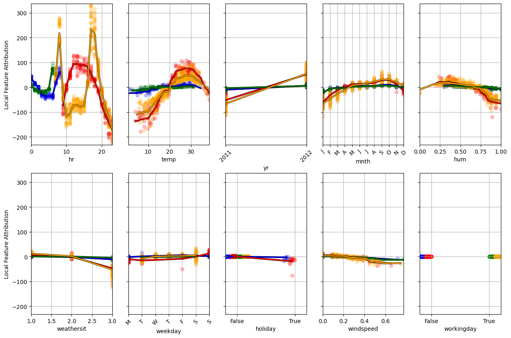

<p align="center">
  
</p>

# Installation

To install this package clone the repository and run

```bash
cd PyFD/
python3 -m pip install .
```

# Unification of Additive Explanations

The typical Machine Learning methodology is as follows
```python
from pyfd.data import get_data_bike
x, y, features = get_data_bike()
x_train, x_test, y_train, y_test = train_test_split(x, y, test_size=0.2, random_state=42)
model = HistGradientBoostingRegressor(random_state=0).fit(x_train, y_train)
print(model.score(x_test, y_test))
```
You load a dataset, train a model on one subset of this data, and evaluate its performance on the other subset.
But is reporting performance on held-off data enough to assess that the model is **trustworthy**?
Not necessarily. It would be preferable to get some insight into the model behavior to be sure that
it makes correct decisions for the right reason. To get insights into model behavior, various post-hoc techniques have been developped, 
notably [Partial Dependence Plots (PDP)](https://scikit-learn.org/stable/modules/partial_dependence.html),
[Permutation Feature Importance (PFI)](https://scikit-learn.org/stable/modules/permutation_importance.html), and
[SHAP](https://github.com/shap/shap).

The motivation behind the `PyFD` package was to realize that these various explanability methods can be unified
through the lens of **Functional Decomposition** ([Our Paper](https://proceedings.mlr.press/v238/laberge24a.html)).
More specifically, let $B$ be a probability distribution over the input space. Then the model $h$ can
be decomposed as follows

$$ h(x) = E_{z\sim B}[h(z)] + \sum_i h_{i,B}(x_i) + \sum_{i<j} h_{ij,B}(x_{ij}) + \ldots,$$

where $h_{i, B}(x_i)$ are called the *main effects* and only depend on a single feature. The remaining terms $h_{u,B}(x_u)$ with
$|u|\geq 2$ are called *interactions* and depend on multiple features simultaneously. The PDP/SHAP/PFI explainers can all be expressed in 
terms of this fonctional decomposition.


This has important practical implications : any package that can efficiently compute this functional decomposition can compute **any** 
explanation method. This is why `PyFD` exists.

```python
from pyfd.decompositions import get_components_tree
from pyfd.shapley import interventional_treeshap

# The background distribution B
background = x_train[:1000]
# Compute the h_1, h_2, ..., terms of the Functional Decomposition
decomposition = get_components_tree(model, background, background, features)
# Compute the Shapley Values
shap_values = interventional_treeshap(model, background, background, features)
```

The functional decomposition can be leveraged to visualize the model behavior locally.

```python
from pyfd.plots import attrib_scatter_plot

# We plot the h_i terms along side the Shapley Values
attrib_scatter_plot(decomposition, shap_values, background, features)
```


Or globally.

```python
from pyfd.decompositions import get_PDP_PFI_importance
from pyfd.shapley import get_SHAP_importance
from pyfd.plots import bar

I_PDP, I_PFI = get_PDP_PFI_importance(decomposition)
I_SHAP = get_SHAP_importance(shap_values)
bar([I_PFI, I_SHAP, I_PDP], features.names())
```


# Increasing Explanation Alignment

In the bar chart shown previously, the three methods attributed very different importance to the feature `workingday`. This is problematic because there is no
**ground-truth** for the optimal explanations and so practitionners are left wondering *which explanation should I believe?* In `PyFD` we do not shy away 
from showing contradicting explanations to the user. In fact, we let disagreements be an incentive for the user to increase the **alignment** between the techniques.

One of the implications of unifying PDP/SHAP/PFI through the lens of functional decomposition is that the root cause of their disagreements 
can be identified : **feature interactions**. Thus, `PyFD` offers methodologies to minimize feature interactions, one of them being regional
explanations with Functional Decomposition Trees (FD-Trees for short).

```python
from pyfd.fd_trees import CoE_Tree

tree = CoE_Tree(max_depth=2, features=features)
tree.fit(background, decomposition)
tree.print()
>>>
# Samples 1000
# If workingday ≤ 0.0000:
# |   If hr ≤ 7.0000:
# |   |   Samples 105
# |   |   Region 0
# |   else:
# |   |   Samples 223
# |   |   Region 1
# else:
# |   If hr ≤ 6.0000:
# |   |   Samples 190
# |   |   Region 2
# |   else:
# |   |   Samples 482
# |   |   Region 3
```

The FD-Tree has decided to partition the input space into four regions based on the `workingday` and `hr` features. We can now compute functional decomposition
while restricting the distribution $B$ to each distinct region.

```python
# Assign each datum to its region
regions = tree.predict(background)
# Describe each region with a rule
rules = tree.rules()
# Compute regional explanations
regional_backgrounds = [[], [], [], []]
regional_decomposition = [[], [], [], []]
regional_shap = [[], [], [], []]
for r in range(4):
    regional_backgrounds[r] = background[regions==r]
    # Regional decomposition
    regional_decomposition[r] = get_components_tree(model,
                                                    regional_backgrounds[r],
                                                    regional_backgrounds[r],
                                                    features, anchored=true)
    # Shapley values
    regional_shap[r] = interventional_treeshap(model,
                                               regional_backgrounds[r],
                                               regional_backgrounds[r],
                                               features)
```

And visualize the local and global model behaviors.

```python
attrib_scatter_plot(regional_decomposition, regional_shap, regional_backgrounds, features)
plot_legend(rules)
```




```python
fig, axes = plt.subplots(1, 4)
for r in range(4):
    I_PDP, I_PFI = get_PDP_PFI_importance(regional_decomposition[r])
    I_SHAP = get_SHAP_importance(regional_shap[r])
    bar([I_PFI, I_SHAP, I_PDP], features.names(), ax=axes[r])
    axes[r].set_title(rules[r])
```


As a result of partioning the input space, there is almost perfect agreement between the PDP/SHAP/PFI feature importance. We no longer have to wonder 
which explanation is the correct one since they all agree!

